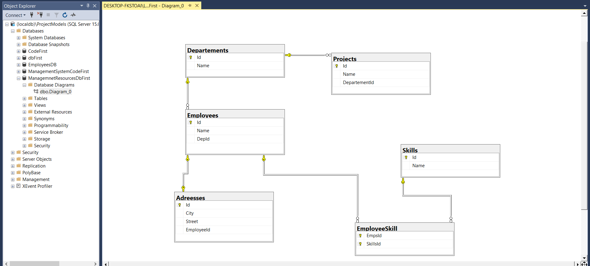

# CleanHR.Core - EF Core Clean Architecture for HR Management

This project demonstrates a simple database schema using **Entity Framework Core** with **Clean Architecture** principles. The structure follows a class library organization, separating concerns into:

- **Domain Layer**
- **Data Layer**

## 📦 Entities

The system includes the following entities:

- **Employee**
- **Department**
- **Project**
- **Address**
- **Skill**

## 🔗 Relationships

- Each **Employee** belongs to one **Department**, and each **Department** can have many **Employees**.
- Each **Employee** has one **Address**, and each **Address** belongs to one **Employee**.
- Each **Department** can have many **Projects**, and each **Project** belongs to one **Department**.
- Each **Employee** can have many **Skills**, and each **Skill** can belong to many **Employees** (Many-to-Many).

## 📁 Project Structure

## 🛠 Tech Stack

- .NET Core  
- Entity Framework Core  
- Class Library structure  
- Clean Architecture principles

## 📸 Project Screenshot

